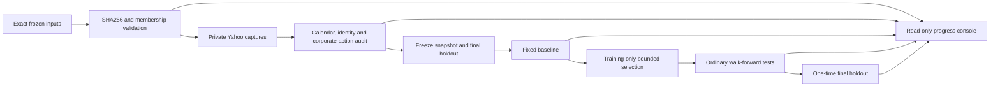

# Architecture and execution boundaries

## Data flow

The latter data and research stages are not connected for real execution in this revision. They remain behind explicit guards. The current core is testable using synthetic fixtures; this does not satisfy real-data audit prerequisites.

## Modules

| Module | Responsibility |
|---|---|
| inputs | Exact byte hashes, ordered groups, membership counts and approved exception |
| provider | Read-only Yahoo chart capture, private raw snapshots and request/hash metadata |
| audit | Nulls, duplicate times, invalid OHLCV, observed session intervals, terminal points and gaps |
| timing | Explicit audited sessions, separate lunch segments, short tail bars and causal eligible opens |
| indicators | Streaming SMA, SMA-seeded EMA/MACD and Wilder ADX |
| signals | Entry-arm separation, cross identity, running positive-hump peak, sizing alternatives |
| portfolio | Unlevered local-currency account, reservations, pyramiding, aggregate exits, costs and tax ledger |
| engine | Chronological bar-completion/open replay with preplanned liquidation events |
| research | Calendar windows, holdout exclusion, applicable candidate axes and neighborhood selection |
| readiness | Closed real-data gate until inputs, canonical synchronization and audits are complete |
| server/web | Read-only process state, configuration, input status and honest empty results |

## Event semantics

A bar's Open becomes executable only at its start. Its completed OHLC becomes indicator information only at its end. The replay core orders completed observations, planned exits, signal decisions and eligible fills explicitly. Delayed orders preserve signal-time slope/ADX and use the actual later Open. Missing opens retain pending state; synthetic prices and forward-filled executions are prohibited.

The portfolio is independent for every market, frequency, basket and candidate. Whole lots, cash plus fees, and pending reservations constrain buys. Stock exits cancel outstanding buys, realize the weighted aggregate position and preserve a residual position if no observed fill is possible. Accrued tax refunds never exceed current-year tax.

All-time technical indicator state may be warmed up using legitimate prior bars, while score intervals remain bounded. Warmup trades are excluded. Earlier fold tests may become later ordinary training history; the final holdout cannot.

## Remaining integration work

1. Restore supported input materialization, verify exact bytes and retain private source metadata.
2. Write approved definitions to a guarded new canonical version, then update the local configuration/hash expectations.
3. Audit actual exchange calendars, Yahoo timestamp semantics, maximum accessible 5m coverage, IPO intervals and each security's identity/lot.
4. Resolve price normalization, split-to-historical-lot conversion, and non-cash distributions without silently including dividends.
5. Generate planned session/month liquidation events and freeze complete holdout dates from audited data.
6. Connect the validated snapshots, approved policy and real-data orchestration; run the baseline first.
7. Add persisted fold manifests, execution diagnostics and actual chart/table rendering, then constrained selection and ordinary OOS tests.
8. Unlock one-time holdout evaluation only after the complete training and reporting rules are fixed.

Passing tests in this revision does not make these unfinished steps complete.
