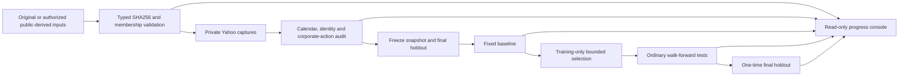

# Architecture and execution boundaries

## Data flow

These stages are connected through the command-line orchestration and exercised using deterministic synthetic fixtures. Actual execution remains behind explicit audit and configuration guards. Synthetic pipeline completion does not satisfy real-data prerequisites.

## Modules

| Module | Responsibility |
|---|---|
| inputs | Separate original/public-derived hash policies, provenance, ordered groups, membership counts and approved exception |
| provider | Read-only Yahoo chart capture, private raw snapshots and request/hash metadata |
| audit | Nulls, duplicate times, invalid OHLCV, observed session intervals, terminal points and gaps |
| audit_package/dataset | Evidence-backed local normalization, per-capture observability, private snapshot hashes and immutable package validation |
| timing | Explicit audited sessions, separate lunch segments, short tail bars and causal eligible opens |
| indicators | Streaming SMA, SMA-seeded EMA/MACD and Wilder ADX |
| signals | Entry-arm separation, cross identity, running positive-hump peak, sizing alternatives |
| portfolio | Unlevered local-currency account, reservations, pyramiding, aggregate exits, costs and tax ledger |
| engine | Chronological bar-completion/open replay with preplanned liquidation events |
| schedule | Calendar-derived minute and month-end liquidation events and entry bans |
| research | Calendar windows, holdout exclusion, applicable candidate axes and neighborhood selection |
| orchestration | Frozen plans, baseline, training selections, continuous OOS, final selection and holdout consumption registry |
| reporting | Cost views, drawdown, utilization, concentration, closure statistics and unique order diagnostics |
| readiness | Closed real-data gate until inputs, canonical synchronization and audits are complete |
| dashboard/server/web | Actual run status, historical tables/curves, synthetic exclusion and self-contained snapshots |

## Event semantics

A bar's Open becomes executable only at its start. Its completed OHLC becomes indicator information only at its end. The replay core orders completed observations, planned exits, signal decisions and eligible fills explicitly. Delayed orders preserve signal-time slope/ADX and use the actual later Open. Missing opens retain pending state; synthetic prices and forward-filled executions are prohibited.

The portfolio is independent for every market, frequency, basket and candidate. Whole lots, cash plus fees, and pending reservations constrain buys. Stock exits cancel outstanding buys, realize the weighted aggregate position and preserve a residual position if no observed fill is possible. Accrued tax refunds never exceed current-year tax.

All-time technical indicator state may be warmed up using legitimate prior bars, while score intervals remain bounded. Warmup trades are excluded. Earlier fold tests may become later ordinary training history; the final holdout cannot.

## Remaining historical execution work

1. Resolve the reported Yahoo HTTP 403 access blocker through the authorized workflow, then audit actual exchange calendars, timestamp semantics, maximum accessible 5m coverage, IPO intervals and each security's identity/lot. Do not bypass the denial.
2. Verify actual vendor price normalization, historical lots and corporate distributions against evidence. The implemented split model rejects unresolved fractional entitlements and distributions.
3. Synchronize remaining indicator, gap-counting, valuation and fold-state conventions with the authoritative configuration. Retain separate JP scaled-base and data-review blockers.
4. Build and validate private packages, freeze actual complete holdout dates and bind the final implementation/configuration hashes.
5. Run the baseline first, then constrained training and ordinary OOS tests, retaining all reports and failure flags.
6. Evaluate the final holdout once only after all dependent rules and selections are fixed.

Passing tests in this revision does not make these unfinished steps complete.
