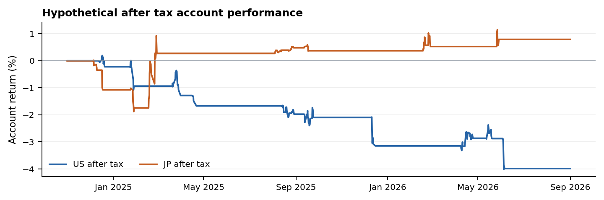

# Original25 daily FULL fixed allocation result

This completed run is an **assumption-based hypothetical simulation**, not verified historical execution, formal validation, an optimized strategy or an investment conclusion. All figures below are total-period account results, not annualized returns.

## Results

| Metric | US account | Japan account |
|---|---:|---:|
| Initial equity | USD 100,000.00 | JPY 16,000,000.00 |
| Final equity | USD 96,016.43 | JPY 16,125,982.89 |
| Gross return on the same trade path | -3.4116% | +1.2619% |
| After fee return | -3.9836% | +1.2619% |
| After tax return | -3.9836% | +0.7874% |
| Maximum after tax account drawdown | 4.1948% | 1.8978% |
| Completed round trips | 13 | 10 |
| Win rate after fees | 15.3846% | 60.0000% |
| Fees | USD 572.00 | JPY 0.00 |
| Net simulated tax | USD 0.00 | JPY 75,917.17 |
| Average calendar-time capital utilization | 1.0262% | 0.4560% |
| Maximum capital utilization | 14.2308% | 8.6852% |
| Below-unit rejected orders | 0 | 13 |

Both accounts ended flat with no unfilled orders, missing-price fills or failed scheduled liquidations. The low average capital usage and the Japan 100-share assumption materially affect the result. Cash earns no modeled interest. Gross and after-fee figures reconcile costs on the same trade path; they are not separate reinvestment simulations.

## Exact runtime scope

- Scored interval: market-local **2024-11-01 inclusive to 2026-09-01 exclusive**
- Warmup: available October 2024 observations only, without prestart orders, positions, tax or P&L
- Late IPOs: use actual available post-listing observations and causal indicator readiness; no fabricated earlier bars or extra common burn-in filter
- Markets: separate fresh USD and JPY accounts; original US12 and Japan13 members retained
- Frequency and arm: daily FULL only; long-only, unlevered; no optimization
- Allocation: fixed original capital / 15 per entry; targets are USD 6,666.666666666667 and JPY 1,066,666.6666666667 before whole-unit execution
- Total held market value plus proposed fill is capped at original market capital; cash is not shared across markets
- Formal holdout: not evaluated. September 2026 and later quote values were excluded before signals, fills, valuation and returns

US: NVDA, AVGO, AMD, MU, TSM, ASML, LRCX, ANET, VRT, MSFT, GOOGL, ORCL.

Japan: 6857.T, 8035.T, 6146.T, 6920.T, 285A.T, 4062.T, 4004.T, 4186.T, 4063.T, 5803.T, 5801.T, 9984.T, 2737.T.

## Signals and exits

SMA5/20 use completed Close. MACD uses SMA-seeded EMA12/26 with EMA9 signal; histogram H is MACD minus signal, without doubling. Wilder ADX14 first becomes defined at observation 28; the first histogram value becomes defined at observation 34.

FULL requires both bullish crosses within the inclusive last five valid completed observations, ADX strictly greater than 25, and three strictly positive histogram increments over four values ending with H greater than zero. Each distinct cross pair can create only one order. Later independent pairs can add to a position. A cross means previous fast less than or equal to slow, followed by current fast greater than slow.

The histogram exit uses the current positive hump's peak. A declining H at or below 60% of the peak, or a nonpositive H, triggers the ordinary exit; evaluate the nonpositive exit before resetting the peak. Price stop and target modules are disabled.

Ordinary orders execute at the next observed tradable session Open strictly after the completed signal. Month-end liquidation is preplanned at the last trading day's Open, with a full-day buy ban. Missing prices never become invented fills. The stored minute delay of 20 and minute cutoff of 63 do not apply to this daily run.

Sells execute before buys. Competing buys rank by descending signal-time SMA5 percentage slope, then ticker and event ID. Slope is a cash-priority key, not an additional entry gate. Cash reservations include estimated fees; queued quantities may shrink but cannot grow at execution. Buys use whole assumed units.

## Costs and accounting

- US commission: min(notional times 0.00495, USD 22) per filled buy or sell
- Japan commission: zero under the retained conditional model
- Spread and slippage: zero; dividends and FX: excluded
- Tax: 20.315% of positive current-calendar-year realized after-fee net profit, accrued on realization with bounded same-year refunds; no cross-year loss carry
- Equity and drawdown: causal observed Opens, completed Closes and scheduled events, including unrealized holdings. Missing marks retain the last known mark and remain flagged
- Utilization: exposure/equity weighted by calendar elapsed time, including nontrading periods
- Currency arithmetic: floating point, without a newly added currency rounding rule

## Economic assumptions

PA01 assumes the cached OHLC is split-adjusted only. PA02 assumes cached split records are complete for the reconstruction. PA03 assumes US one-share and Japan 100-share order units. PA04 retains cached ticker-to-issuer continuity as a disclosed operational simplification. None is promoted to an independently verified source fact.

Recorded split factors reconstruct historical price/share units. At an effective split, held/pending quantities and price-dimensional indicator state are adjusted consistently without changing total position cost. Later recorded split factors only undo snapshot normalization of earlier prices; later quote values are not replayed. Concrete unsupported special actions, contradictory records or invalid account states still block the hypothesis mode.

The approximately two-year preselected cache is shorter and narrower than the formal five-year/full-universe study. Selection/survivorship bias, simplified costs/tax and incomplete economic source certification remain limitations. The original packaged review statuses remain pending.

## Verification and provenance

The reviewed implementation passed 130 software tests. The review strengthened two input guards: duplicate effective split times with conflicting ratios and split events outside known session Opens. The final replay then reproduced every preliminary trade, order, equity point and metric exactly. Independent checks reconciled trades, fees, tax, cash and drawdown and verified next-Open fills, month-end buy bans, units, targets and protected dates. These checks verify implementation behavior, not the historical truth of the economic assumptions.

The completed run used canonical **v0.16**, source SHA256 `b727826e136611f31822915375903c88967243e43e791cb5c52d89c613f8fe6b`. Its original/public-byte distinction is recorded in [runtime_config.json](runtime_config.json). Sections 3 through 13 are unchanged from v0.15; v0.16 provides the explicit hypothesis authorization. The executable parameter snapshot retained its v0.15 label and digest without changing its numeric rules.

Implementation base: `5d429ec1f4478b1dd7c6895df75ae546020b64c2`, plus the reviewed hypothesis mode recorded by file hashes. The execution used modified source and does not claim a nonexistent final run commit. Original input ZIP SHA256: `68e795b24de5f6d0f3f32caa960c026f32b3d8a8389d68f9c77a615904f1d638`.

The reviewed implementation and test patch remains private; its SHA256 is `94255f22de188f1e317ff43710317ab6379ea3be610ed8bacb6988747e8cf65b`. This publication does not replace the repository's executable defaults, and the default branch does not yet implement this hypothesis runner. The public files are a configuration and result record, not a fully public reproduction package. Runtime configuration SHA256: `34564eb58d3374a2ea2bb35491164373446d4abb4c1ede16fba4f245bb879759`.

## Files

- [Full configuration and results PDF](Fixed_Baseline_Report.pdf)
- [Machine-readable runtime configuration](runtime_config.json)
- [Machine-readable results](results.json)
- [Completed derived round trips](completed_trades.csv)
- [Monthly derived account summaries](monthly_account_summary.csv)
- [Artifact digests](SHA256SUMS.json)

This publication contains derived research results and configuration evidence. It contains no raw vendor payloads, full market-price dataset, credentials, private source identifiers or local execution paths.
